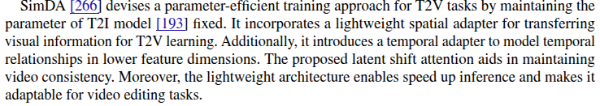

# efficient_video_generation

## 1 Parameter-Efficient Method

### 1.1 ControlNets
[description](controlnet.md)

### 1.2 Adapters
[description](adapter.md)
1. SimDA: Simple Diffusion Adapter for Efficient Video Generation
[paper](https://openaccess.thecvf.com/content/CVPR2024/papers/Xing_SimDA_Simple_Diffusion_Adapter_for_Efficient_Video_Generation_CVPR_2024_paper.pdf)
[code](https://github.com/ChenHsing/SimDA)

    devises a parameter-efficient training approach by maintaining the parameter of the T2I model and uses two adapters to train it.
2. I2V-Adapter: A General Image-to-Video Adapter for Diffusion Models
[paper](https://arxiv.org/pdf/2312.16693)
3. 

### 1.3 Low Rank Adaption

1. AnimateDiff
2. DragVideo
3. MagicStick

## 2 Efficient Sampling and Inference

### 2.1 Training Free Method

### 2.2 Training Based Method

## 3 Efficient Architecture
U-Net, DiT, U-ViT, MamBa

## 4 Current Video Genaration Models
### 4.1 Text-to-video Generation
CogVideo

CogVideoX

MagicVideo: employ Latent Diffusion Model for T2V generation

Imagen Video

ControlVideo

Control-A-Video

StoryDiffusion

Ctrl-Adapter

Animate Anymore

Make-A-Video: the network learns visual-textual correlations from paired image-text data and captures video motion from unsupervised video data
ideoFu
Latent-Shift: focuses on lightweight temporal modeling

### 4.2 Image-to-video Generation
1. ***AnimateDiff:*** Animate Your Personalized Text-to-image Diffusion Models without Specific Tuning [[Paper]](https://openreview.net/pdf?id=Fx2SbBgcte) [[Project]](https://animatediff.github.io/)

## 5 Preference Optimization
