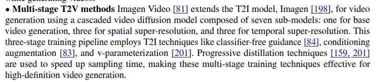

# efficient_video_generation
## 0 History

## 1 Parameter-Efficient Method

### 1.1 ControlNets
[description](controlnet.md)

### 1.2 Adapters
[description](adapter.md)
1. SimDA: Simple Diffusion Adapter for Efficient Video Generation (CVPR 24)
[paper](https://openaccess.thecvf.com/content/CVPR2024/papers/Xing_SimDA_Simple_Diffusion_Adapter_for_Efficient_Video_Generation_CVPR_2024_paper.pdf)
[code](https://github.com/ChenHsing/SimDA)
   1) tune the T2I (Stable Diffusion) model for T2V by designing light-weight spatial and temporal adapters for transfer learning. 
   2) change the original spatial attention to the proposed latent-shift attention for temporal consistency.

2. I2V-Adapter: A General Image-to-Video Adapter for Diffusion Models
[paper](https://arxiv.org/pdf/2312.16693)
3. CTRL-Adapter: An Efficient and Versatile Framework
for Adapting Diverse Controls to Any Diffusion Model
[paper](https://arxiv.org/pdf/2404.09967) [code](https://github.com/HL-hanlin/Ctrl-Adapter)
4. X-Adapter: Adding Universal Compatibility of Plugins for Upgraded Diffusion Model
[paper](https://showlab.github.io/X-Adapter/static/Paper/X_Adapter_Arxiv.pdf)
[code](https://github.com/showlab/X-Adapter)

### 1.3 Low Rank Adaption

1. AnimateDiff: Animate Your Personalized Text-to-image Diffusion Models without Specific Tuning (ICLR 24) [[Paper]](https://openreview.net/pdf?id=Fx2SbBgcte) [[Project]](https://animatediff.github.io/)
2. DragVideo: Interactive Drag-style Video Editing (ECCV 24) [paper](https://arxiv.org/pdf/2312.02216) [code](https://github.com/RickySkywalker/DragVideo-Official)

3. MagicStick (WACV 25)no code

## 2 Efficient Sampling and Inference

### 2.1 Training Free Method

### 2.2 Training Based Method

## 3 Efficient Architecture
U-Net, DiT, U-ViT, MamBa

## 4 Current Video Genaration Models
### 4.1 Text-to-video Generation
CogVideo

CogVideoX

MagicVideo: employ Latent Diffusion Model for T2V generation

Imagen Video

ControlVideo

Control-A-Video

StoryDiffusion

Ctrl-Adapter

Animate Anymore

Make-A-Video: the network learns visual-textual correlations from paired image-text data and captures video motion from unsupervised video data
ideoFu
Latent-Shift: focuses on lightweight temporal modeling

### 4.2 Image-to-video Generation
1. ***AnimateDiff:*** Animate Your Personalized Text-to-image Diffusion Models without Specific Tuning [[Paper]](https://openreview.net/pdf?id=Fx2SbBgcte) [[Project]](https://animatediff.github.io/)

## 5 Preference Optimization
