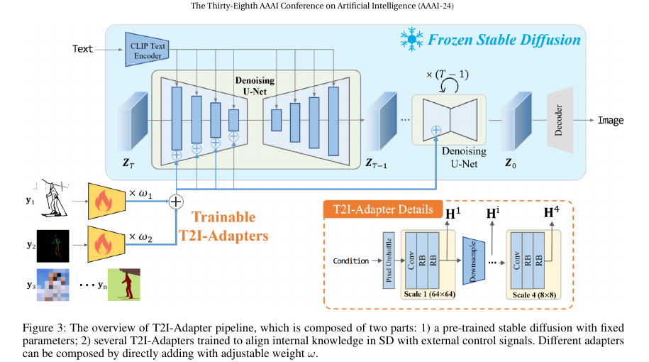
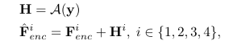

# Adapter

I2V-Adapter [link](https://ojs.aaai.org/index.php/AAAI/article/view/28226)

## Overview  

The **T2I-Adapter framework** consists of two main components:

1. **Pre-trained Stable Diffusion Model**  ([Stable Diffusion](sd.md))
   - The base generative model remains frozen to retain its learned knowledge.  

2. **Multiple T2I Adapters**  
   - These adapters extract guidance features from external control signals (e.g., sketches, depth maps, semantic masks) and inject them into the generation process, providing better spatial control over image synthesis.  

---

## Motivation  

Text-based conditioning in Stable Diffusion provides **semantic guidance** but lacks **structural control**.  
To address this, **T2I-Adapters** introduce **spatial alignment mechanisms**, ensuring that generated images follow specific structures or patterns.

Key motivations include:
- **Text alone is insufficient for fine-grained control.**  
- **External conditions (e.g., sketches, depth maps, color palettes) can provide richer information.**  
- **Directly modifying the Stable Diffusion model is computationally expensive.**  
- **Using lightweight adapters enables flexible and modular control without retraining the entire model.**

---

## How T2I-Adapter Works  

The **T2I-Adapter extracts multi-scale conditional features** from the external control inputs and injects them into the **U-Net encoder** of Stable Diffusion.

1. **Feature Extraction & Downsampling**  
   - The adapter processes the input through **multiple feature extraction blocks (Conv + Residual Blocks, RBs)**.  
   - **Downsampling blocks** adjust the spatial resolution to match different levels of the U-Net encoder.  

2. **Multi-Scale Feature Injection**  
   - The extracted **features H** are **added to the intermediate feature maps $F_{\text{enc}}$ of the U-Net**.  
   - Since **H and $F_{\text{enc}}$ share the same dimensionality**, they are seamlessly fused at different scales.  
   - This allows **both global and local structure control** in the diffusion process.

