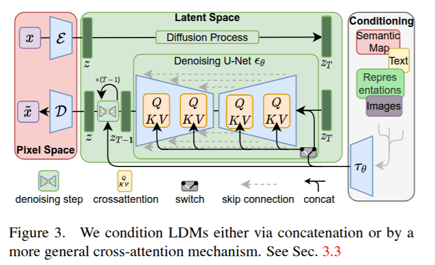

# Stable Diffusion
[An explaination](https://mp.weixin.qq.com/s?__biz=Mzk0MzIzODM5MA==&mid=2247486486&idx=1&sn=aff9ed60bba2cbf9efd32aa68557c93b&chksm=c337b18ff4403899d24ac32a60dbfd0402aab7309e8442dabdcb14cd61cfb55ad6cc1f977b3b&scene=21#wechat_redirect)

[paper](https://arxiv.org/pdf/2112.10752v2.pdf)
## Overview of Stable Diffusion

The biggest difference between Stable Diffusion and previous Diffusion models lies in whether the **denoising process** is performed in image space or latent space. The earliest DDPM (Denoising Diffusion Probabilistic Model) performed noise addition and removal directly in **image space**. 
However, this approach requires significant computational resources because the high resolution of images results in extremely large computational consumption.  

To address this, **Stable Diffusion** transforms the diffusion model into **latent space**, reducing the computational complexity while maintaining high efficiency.

First, **Stable Diffusion** involves an encoding process, which can be understood as a VAE (Variational Autoencoder). 
This process encodes the image into latent space, where the denoising and image recovery occur instead of in pixel space.  

The first step in the diffusion process is to gradually add noise to the latent representation of the image, which means the model learns to represent noisy images in **latent space** rather than in direct pixel space. Once the noisy samples are prepared, the model then learns to gradually remove noise step by step.

The noise and conditions (e.g., text prompts) are fed into a U-Net, which progressively removes noise. 

Finally, after processing the noisy latent representation through the decoder, a fully recovered image is obtained.

## Perceptual Compression
VAE
learn a latent space representation

## Condition Control

[cross attention](cross_attention.md)